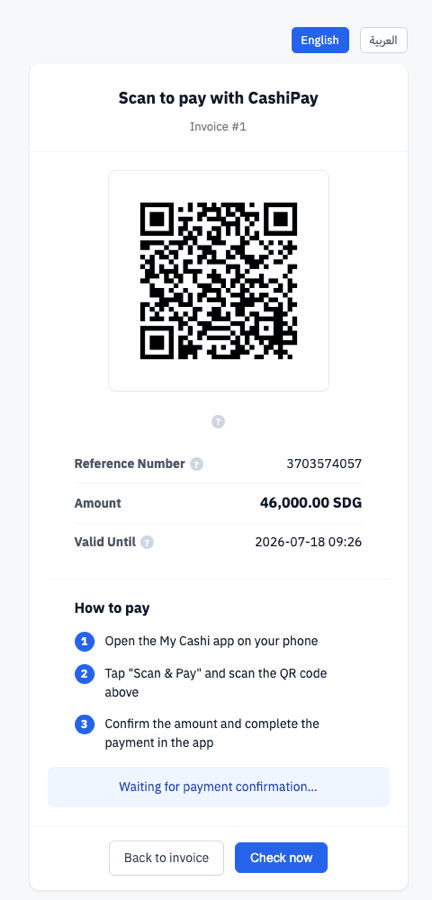
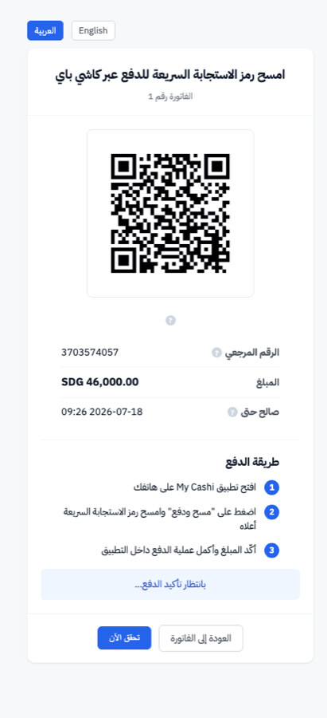
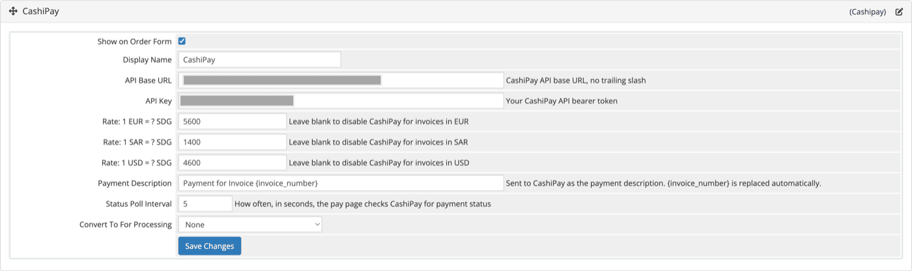
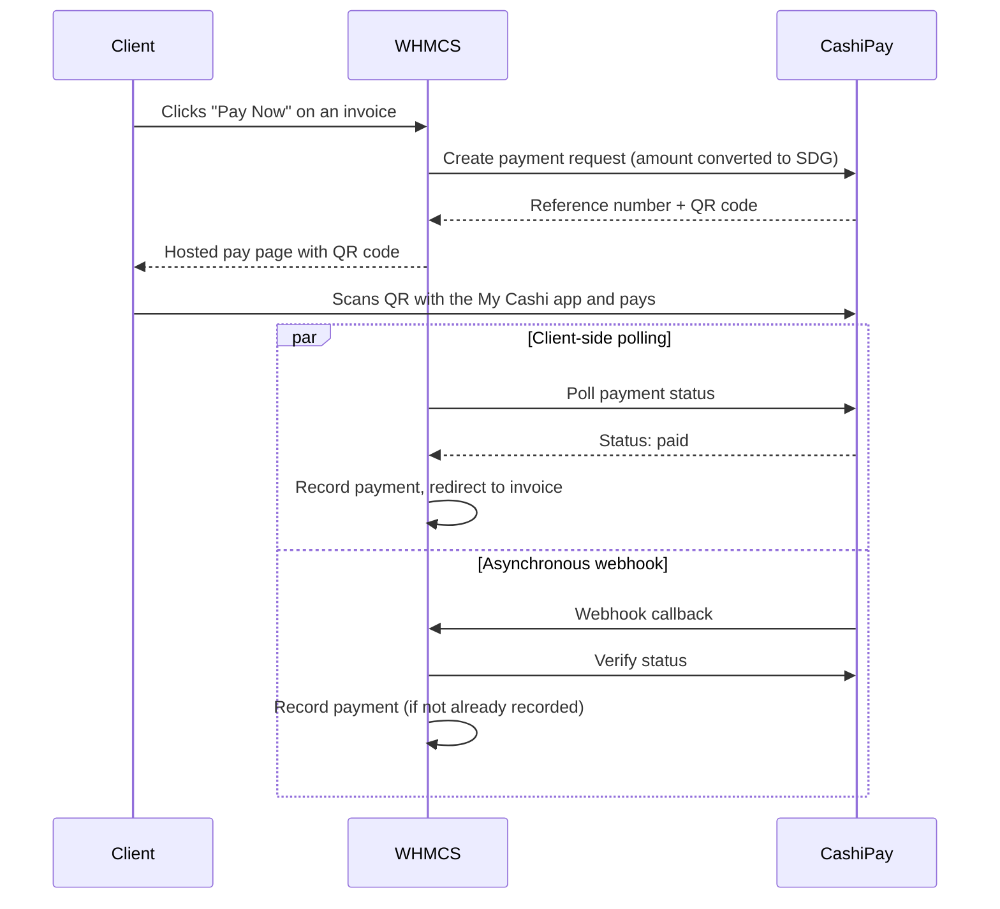

# CashiPay for WHMCS

[](LICENSE)
[](https://www.whmcs.com/)
[](https://www.php.net/)
[](#)
[](#)
[](#)
[](#contributing)

A third-party payment gateway module that lets [WHMCS](https://www.whmcs.com/) clients pay invoices through **CashiPay**, a QR-based mobile payment provider that settles in Sudanese Pound (SDG).

Instead of redirecting customers to an external checkout page, CashiPay renders its own hosted payment page inside your WHMCS installation — showing a live QR code, the payment reference number, and real-time payment status — in both **English and Arabic**.

<br>

<p align="center">
  
  &nbsp;&nbsp;&nbsp;
  
</p>
<p align="center"><em>The hosted payment page in English (left) and Arabic with full RTL layout (right)</em></p>

<br>

## Table of Contents

- [Screenshots](#screenshots)
- [Features](#features)
- [Requirements](#requirements)
- [Installation](#installation)
- [Configuration](#configuration)
- [How It Works](#how-it-works)
- [Multi-Currency Support](#multi-currency-support)
- [Localization](#localization)
- [File Structure](#file-structure)
- [Security](#security)
- [Troubleshooting](#troubleshooting)
- [Contributing](#contributing)
- [License](#license)
- [Credits](#credits)

<br>

## Features

- **Native hosted payment page** — no redirect to a third-party domain; the QR code and payment status are shown directly on your WHMCS client area.
- **Live status polling** — the payment page automatically detects when a payment is completed and redirects the customer back to their invoice.
- **Asynchronous webhook support** — a dedicated callback endpoint records payments the moment CashiPay confirms them, independent of whether the customer's browser is still open.
- **Race-condition-safe payment recording** — an atomic claim mechanism ensures an invoice is never credited twice, even if the webhook and the client-side status check both resolve "paid" at the same time.
- **Automatic multi-currency conversion** — CashiPay settles exclusively in SDG. The module automatically generates one exchange-rate field per active currency configured in your WHMCS installation.
- **Bilingual interface** — English and Arabic, complete with right-to-left (RTL) layout support and a language switcher on the payment page.
- **Clear, translated error messages** — connection issues, missing exchange rates, expired or failed payments are all explained to the customer instead of failing silently.
- **Self-hosted typography** — uses the IBM Plex Sans Arabic typeface, bundled locally so no external font requests are made from the payment page.
- **Contextual help tooltips** — hover-to-reveal explanations next to the QR code, reference number, and expiry time.

<br>

## Screenshots

<table>
  <tr>
    <td align="center" width="50%">
      
      <br>
      <sub><b>Hosted payment page — English</b></sub>
    </td>
    <td align="center" width="50%">
      
      <br>
      <sub><b>Hosted payment page — Arabic (RTL)</b></sub>
    </td>
  </tr>
</table>

<p align="center">
  
</p>
<p align="center"><sub><b>Gateway settings in the WHMCS admin area — Setup → Payments → Payment Gateways</b></sub></p>

<br>

## Requirements

| Requirement | Version |
|---|---|
| WHMCS | 8.x or 9.x |
| PHP | 7.4 or later |
| PHP Extensions | `curl`, `json` |
| CashiPay | An active CashiPay merchant account and API key |

<br>

## Installation

1. Download or clone this repository.
2. Copy the `modules/` directory into the root of your WHMCS installation, merging it with the existing `modules/` folder:

   ```
   your-whmcs-root/
   └── modules/
       └── gateways/
           ├── cashipay.php
           ├── cashipay/
           │   ├── helper.php
           │   ├── lang.php
           │   ├── pay.php
           │   ├── qr.php
           │   ├── status.php
           │   └── fonts/
           └── callback/
               └── cashipay.php
   ```

3. Log in to the WHMCS admin area and navigate to **Setup → Payments → Payment Gateways**.
4. Under the **All Payment Gateways** tab, find **CashiPay** and click to activate it.
5. Fill in your configuration (see [Configuration](#configuration) below) and save.

<br>

## Configuration

| Field | Description |
|---|---|
| **API Base URL** | The CashiPay API endpoint. Defaults to the production endpoint; only change this if CashiPay has provided you with a different one (e.g. a sandbox URL). |
| **API Key** | Your CashiPay API bearer token, available from your CashiPay merchant dashboard. |
| **Rate: 1 `<CURRENCY>` = ? SDG** | One field is generated automatically for every currency active in your WHMCS installation (except SDG). Leave a currency's rate blank to disable CashiPay for invoices in that currency. |
| **Payment Description** | The description sent to CashiPay for each payment request. Supports the `{invoice_number}` placeholder. |
| **Status Poll Interval** | How often, in seconds, the payment page checks CashiPay for a status update. |

> **Tip:** the exchange-rate fields are generated dynamically from your WHMCS currency list each time the settings page loads. If you add a new currency in WHMCS, revisit the CashiPay settings page to configure its rate.

<br>

## How It Works



Both the client-side status check and the webhook are capable of recording the payment independently — whichever one observes the "paid" status first wins, and the other safely backs off without crediting the invoice twice.

<br>

## Multi-Currency Support

CashiPay settles exclusively in **SDG (Sudanese Pound)**. Since invoices in WHMCS can be issued in any currency configured on the system, this module converts the invoice total to SDG at the time of payment, using the exchange rate configured for that currency.

If a customer's invoice currency has no exchange rate configured, they will see a clear, translated message explaining that CashiPay is not available for that currency, instead of a failed or confusing payment attempt.

<br>

## Localization

The hosted payment page is available in:

- 🇬🇧 **English**
- 🇸🇩 **Arabic** (`العربية`), with full right-to-left layout support

Customers can switch languages directly from the payment page. Arabic text is rendered using the self-hosted **IBM Plex Sans Arabic** typeface for consistent, high-quality display across devices.

<br>

## File Structure

```
modules/gateways/
├── cashipay.php                  # Main gateway module (metadata, config, payment link)
├── cashipay/
│   ├── helper.php                # CashiPay API client and shared helper functions
│   ├── lang.php                  # English/Arabic translation strings
│   ├── pay.php                   # Hosted payment page (QR code, status, instructions)
│   ├── qr.php                    # Local QR code generation fallback
│   ├── status.php                # JSON endpoint polled by the payment page
│   └── fonts/                    # Self-hosted IBM Plex Sans Arabic font files
└── callback/
    └── cashipay.php               # Asynchronous webhook handler
```

<br>

## Security

- All payment amounts are re-verified against CashiPay's API before an invoice is credited; client-supplied values are never trusted directly.
- The webhook independently re-fetches the authoritative payment status from CashiPay rather than trusting the callback payload alone.
- Payment recording uses an atomic database claim to prevent duplicate crediting under concurrent requests.
- The API key is stored using WHMCS's encrypted gateway settings storage.

If you discover a security issue, please open an issue on this repository or contact the author directly rather than disclosing it publicly.

<br>

## Troubleshooting

**The pay page reloads with no visible message.**
Check **Setup → Payments → Payment Gateways → CashiPay** and confirm a valid API key is configured. Also check the WHMCS Gateway Log (**Utilities → Logs → Gateway Log**) for the underlying API response.

**"CashiPay is not available for this invoice's currency."**
The invoice's currency has no exchange rate configured. Add a rate for that currency on the CashiPay settings page.

**The QR code doesn't scan.**
The QR code shown is generated directly by CashiPay's API and is intended to be scanned with the official **My Cashi** app.

<br>

## Contributing

Issues and pull requests are welcome. Please open an issue first to discuss any significant change before submitting a pull request.

<br>

## License

Released under the [MIT License](LICENSE).

<br>

## Credits

**Author:** [ABDALRAHMAN MOLOOD](https://amolood.com)

**Sponsored by:** [Digitalize Lab](https://digitalize.sd)
